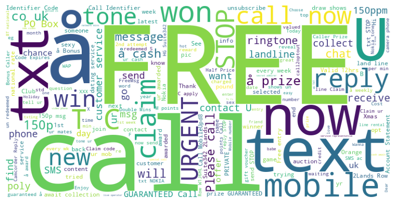
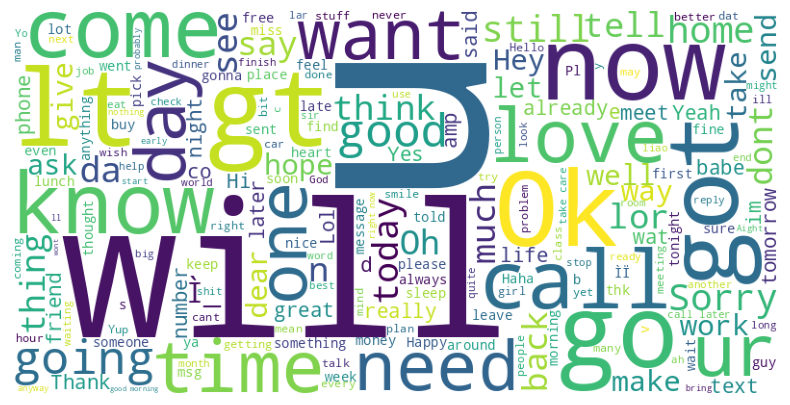

# Spam Detector - Machine Learning Project

*(English version)*

## 📝 Overview

This project is a **spam detection system** built with Python. It uses **Natural Language Processing [(NLP)](https://en.wikipedia.org/wiki/Natural_language_processing)** and **[Machine Learning](https://en.wikipedia.org/wiki/Machine_learning)** techniques to classify text messages as either **spam** or **ham** (non-spam).

---

## 🚀 Features

- **Text Preprocessing**:  
  - Breaks text into smaller parts (tokenization), removes unnecessary words (stopwords), and simplifies words to their base form (lemmatization).

- **Data Visualization**:  
  - Creates word clouds to show the most common words in spam and normal messages.

- **Spam Classification**:  
  - Converts text into numbers using **[TF-IDF](https://en.wikipedia.org/wiki/Tf%E2%80%93idf) Vectorization**.  
  - Trains a **Naive Bayes Multinomial** model to classify messages accurately.

---

# Détecteur de Spam - Projet Machine Learning

*(Version française)*

## 📝 Aperçu

Ce projet est un **système de détection de spam** développé en Python. Il utilise des techniques de **Traitement Automatique du Langage Naturel [NLP](https://fr.wikipedia.org/wiki/Traitement_automatique_du_langage_naturel)** et de **[Machine Learning](https://fr.wikipedia.org/wiki/Apprentissage_automatique)** pour savoir si un message est un **spam** ou un message normal (**ham**).

### Nuage de mots - Spam

### Nuage de mots - Ham

---

## 🚀 Fonctionnalités

- **Prétraitement des textes** :  
  - Divise les messages en mots simples (tokenisation), enlève les mots inutiles (stopwords) et simplifie les mots à leur forme de base (lemmatisation).

- **Visualisation des données** :  
  - Crée des nuages de mots pour afficher les mots les plus utilisés dans les spams et les messages normaux.

- **Classification des spams** :  
  - Transforme les textes en chiffres avec la **vectorisation [TF-IDF](https://fr.wikipedia.org/wiki/TF-IDF)**.  
  - Utilise un modèle **Naive Bayes Multinomial** pour prédire si un message est un spam ou non.
